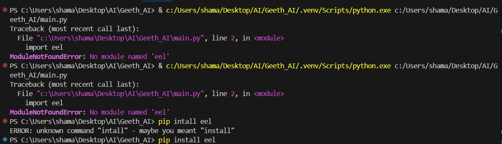

## Description
playing start sound
Connecting API

## Steps to Reproduce
1. Go to '...'
2. Click on '...'
3. Scroll down to '...'
4. See error

## Expected Behavior
after impoorting modules auto play starting sound
Auto connect to ntwork for vice recognition

in type of these error it is requiring modules..because of that run these commands as follow one by one.

## Environment (please complete the following):
- OS: [e.g. Windows 11]
- Python version: [e.g. 3.9]
- Browser (if web related): [e.g. Chrome, Firefox]

## Additional Context
install all modules as follows

pip install eel
pip install playmusic
pip install pyaudio
pip install pyautogui
pip install pyttsx3
pip install --ignore-requires-python SpeechRecognition
pip install pywhatkit
pip install pvporcupine
pip install hugchat
pip install opencv-contrib-python

